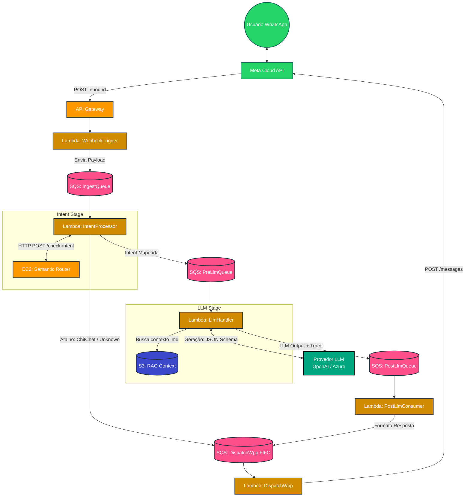

# FSI GenAI Semantic Router Pattern

> **Enterprise-grade serverless message pipeline for WhatsApp using Semantic Routing, Dynamic RAG, and Structured LLM Outputs.**

This repository provides a Reference Architecture for builders in the Financial Services Industry (FSI) and Enterprise sectors who need to process high-volume WhatsApp messages with Generative AI securely, predictably, and cost-effectively.

## 📖 Overview & Business Value

Routing every inbound user message directly to a heavy LLM (Large Language Model) is expensive, slow, and prone to hallucinations. This architecture introduces a **Semantic Router Gateway** pattern:

1. **Low Latency Triage:** Inbound messages are semantically analyzed in milliseconds to determine intent (e.g., *Pix Transfer*, *Fraud Alert*, *FAQ*).
2. **Dynamic Context (RAG):** Based on the exact intent, only the highly relevant markdown policies are loaded from S3.
3. **Structured Outputs:** The LLM is constrained to output strict JSON schemas, allowing safe, seamless integration with legacy banking APIs (Mainframes/Core Banking).
4. **Resiliency:** The flow is decoupled with **standard SQS** queues (ingest, pre-LLM, post-LLM) plus a **FIFO** outbound queue (`dispatch-wpp`), each with **Dead-Letter Queues**, to absorb retries and protect downstream rate limits.
Stack naming follows `{Environment}-nvidia-demo-*` (see `template.yaml`).

---

## 🏗 Architecture & Data Flow



- **WhatsappWebhookTrigger** — Validates Meta subscription (GET), extracts **text** bodies from webhook JSON (POST), assigns a `correlation_id`, captures `phone_number`, business `phone_number_id`, optional `whatsapp_message_id` for typing indicators, appends the first **`pipeline_trace`** step (`webhook`), and sends to **ingest** queue.
- **IntentProcessor** — Reads ingest messages, **POST**s `{ "text": "..." }` to the semantic router (`SMART_ROUTER_URL`), records **`semantic_router_latency_ms`** on the `intent` trace step, optionally sends a **typing indicator** before pre-LLM when IDs are present, then either enqueues **pre-LLM** with `{ correlation_id, text, intent, phone fields… }` or, for **ChitChat** / **Unknown**, enqueues a templated reply directly on **`dispatch-wpp`** (FIFO) — skipping LLM and post-LLM.
- **LlmHandler** — Resolves `intent_suggested`, loads matching `.md` from S3 under the intent prefix (dynamic RAG), measures **`rag_s3_latency_ms`** and **`llm_e2e_latency_ms`**, runs **structured JSON-schema** completion via LiteLLM, attaches model / token usage / **TPOT** and **TPS** on the `llm_handler` trace step, and enqueues **post-LLM** queue.
- **PostLlmConsumer** — Parses `llm_output`, logs one JSON line per message, appends `post_llm` to **`pipeline_trace`**, enqueues outbound text to **`dispatch-wpp`** when applicable, and emits a **multi-line performance report** (CloudWatch `INFO`) for the full LLM path.
- **DispatchWpp** — FIFO consumer that calls the WhatsApp Cloud API to send text; appends `dispatch_wpp` to **`pipeline_trace`** in structured logs.

Infra also provisions **RAG bucket**, **semantic-router artifact bucket**, optional **EC2 + Elastic IP + security group**, IAM roles, **SQS FIFO `dispatch-wpp` + DLQ**, and **SSM parameters** for router URL and LLM settings.

### Pipeline trace & performance report

Each SQS payload may carry a single JSON array **`pipeline_trace`**: ordered steps with UTC ISO-8601 **`start`** / **`end`** timestamps. Optional numeric metrics are merged into the step dict (see [`shared/traceutil.py`](shared/traceutil.py): `append_completed_step`, `step_duration_ms`).

| Step | Where appended | Notable metrics (when present) |
|------|----------------|--------------------------------|
| `webhook` | WhatsappWebhookTrigger | — |
| `intent` | IntentProcessor | `semantic_router_latency_ms` |
| `llm_handler` | LlmHandler | `rag_s3_latency_ms`, `llm_e2e_latency_ms`, `llm_model_id`, `llm_input_tokens`, `llm_output_tokens`, `llm_tpot_ms`, `llm_tps` |
| `post_llm` | PostLlmConsumer | — |
| `dispatch_wpp` | DispatchWpp | — |

The **performance report** is logged at the end of successful **post-LLM** handling only (messages that never reach post-LLM — e.g. ChitChat routed straight to dispatch — do not get this report). It summarizes ingest/routing prep, router latency, RAG fetch, LLM inference (including bottleneck % of wall-clock pipeline time), and output formatting, using trace timestamps plus the metrics above.

For EC2 bootstrap, S3 sync, systemd, and Terraform parity, see **[`services/semantic-router/README.md`](services/semantic-router/README.md)**.

---

## Repository layout

| Path | Purpose |
|------|---------|
| [`template.yaml`](template.yaml) | SAM / CloudFormation — queues, Lambdas, HTTP API, S3, optional EC2, SSM parameter *definitions*. |
| [`samconfig.toml`](samconfig.toml) | Default and **two-phase** deploy profiles (`deploy-router-phase1` / `deploy-router-phase2`). |
| [`Makefile`](Makefile) | `sam build`, deploy orchestration, RAG sync, SSM helpers. |
| `functions/*/` | One Lambda per folder (`app.py` + optional JSON schemas in `llm-handler`). |
| [`shared/`](shared/) | Copied into each Lambda artifact: `logutil`, `ssmutil`, **`traceutil`** (pipeline trace + duration helpers), **`wpputil`** (Graph API send / typing). |
| [`layers/httpx/`](layers/httpx/) | Lambda layer (e.g. LiteLLM stack for HTTP-capable functions). |
| [`rag-context/`](rag-context/) | Markdown (and related) files synced to S3 prefix `context/` for RAG. |
| [`scripts/`](scripts/) | SSM sync, SAM parameter overrides, ingest simulation, etc. |
| [`services/semantic-router/`](services/semantic-router/) | FastAPI service packaged and published to the artifact bucket for EC2 user-data. |

---

## Requirements

Install these on your workstation (versions are indicative; align with your org standard):

- **AWS CLI** v2 (`aws --version`)
- **AWS SAM CLI** (`sam --version`) — builds Python **3.13** functions for **arm64**
- **Docker** — SAM uses containers for consistent builds of Makefile-based functions
- **GNU Make**
- **Python 3.10+** (scripts use the stdlib; **3.13** matches Lambda runtime)
- An **AWS account** with permission to create IAM roles, Lambda, API Gateway v2, SQS, S3, SSM parameters, and optionally EC2/EIP

**AWS credentials**: configure a profile (e.g. `export AWS_PROFILE=...` or set `AWS_PROFILE` in `.env`) that can deploy the stack and write SSM parameters in your target region.

---

## Basic configuration

### 1. Environment file (local only)

Copy the pattern below into a **repo-root** `.env` (this file is **gitignored**). Replace placeholders with your values; never commit production secrets.

```bash
# Logical environment: dev | uat | prod | poc (must match template Parameter Environment)
ENVIRONMENT=dev
AWS_REGION=sa-east-1
AWS_PROFILE=your-aws-cli-profile

# Required when SemanticRouterEc2Enabled=true: VPC + public subnet (IGW route) for the router EC2
SEMANTIC_ROUTER_VPC_ID=vpc-xxxxxxxx
SEMANTIC_ROUTER_PUBLIC_SUBNET_ID=subnet-xxxxxxxx

# LLM (OpenAI-compatible or Azure OpenAI via LiteLLM model id, e.g. azure/gpt-4o-mini)
MAIN_LLM_API=https://api.openai.com/v1
MAIN_LLM_KEY=sk-...
MAIN_LLM_MODEL=gpt-4o-mini
MAIN_LLM_TIMEOUT_S=30
# Optional: Azure API version query string when using Azure host
MAIN_LLM_API_VERSION=

# Semantic router shared secret (Bearer). EC2 syncs from SSM on boot/restart.
SMART_ROUTER_KEY=generate-a-long-random-secret

# Meta / WhatsApp webhook
META_WEBHOOK_VERIFY_TOKEN=your-verify-token
META_WEBHOOK_APP_SECRET=your-app-secret
META_WEBHOOK_WHATSAPP_API_TOKEN=

# WhatsApp Business phone_number_id (Graph API; same Business line for send/receive on Cloud API)
META_PHONE_NUMBER_ID=

# Optional: after deploy, for scripts/simulate_ingest_message.py
INGEST_QUEUE_URL=https://sqs.<region>.amazonaws.com/<account>/<env>-nvidia-demo-ingest
```

The Makefile reads `ENVIRONMENT`, `AWS_REGION`, and `AWS_PROFILE` from `.env` when present (see [`Makefile`](Makefile)).

### 2. SSM Parameter Store layout

Scripts under `scripts/` push values to:

**Prefix:** `/{ENVIRONMENT}/nvidia-demo/`

| Suffix (relative) | Type | Typical source |
|-------------------|------|----------------|
| `SMART_ROUTER_URL` | String | Set by stack when EC2 is enabled (EIP URL); or set manually. |
| `SMART_ROUTER_KEY` | SecureString | `make sync-smart-router-key` or `scripts/sync_smart_router_key.py` |
| `main_llm_api`, `main_llm_model`, `main_llm_timeout`, `main_llm_api_version` | String | `make ssm-string-params` / `scripts/ssm_put_string_params_from_env.py` |
| `main_llm_key` | SecureString | `make ssm-secrets` / `scripts/ssm_put_secrets_from_env.py` |
| `meta_phone_number_id` | String | Same string script — `.env` **`META_PHONE_NUMBER_ID`** (WhatsApp Business Graph phone number ID) |
| `meta_webhook_*` | SecureString | Same secrets script |

Lambdas resolve parameters via [`shared/ssmutil.py`](shared/ssmutil.py) using the **`ENVIRONMENT`** Lambda env var set from the stack.

---

## Deploy

### First-time deploy (semantic router EC2)

The template can create an EC2 instance that **bootstraps from S3**. On a **cold** account, the artifact bucket must exist **before** the instance first runs. Use the **two-phase** flow:

```bash
make deploy-bootstrap
```

This runs (see [`Makefile`](Makefile)): `sam build` → deploy with **`SemanticRouterEc2Enabled=false`** → publish semantic-router artifacts → deploy with **`SemanticRouterEc2Enabled=true`** → push string SSM params from `.env`.

### Routine updates

After the stack and router exist:

```bash
make deploy
```

This performs a single `sam deploy` (with parameter overrides from [`scripts/sam_parameter_overrides.py`](scripts/sam_parameter_overrides.py)), republishes the router bundle, and refreshes string parameters.

### Secrets (run when keys or tokens rotate)

```bash
make ssm-secrets
```

### RAG documents

After deploy, sync local markdown under `rag-context/` to the stack’s RAG bucket (`context/` prefix):

```bash
make sync-rag-context
```

---

## After deploy

1. **Outputs** — From CloudFormation / SAM outputs, copy **`HttpApiUrl`** and configure it as the Meta WhatsApp **callback URL** (same path as deployed, typically `/`).
2. **Webhook verify** — Meta GET challenge must match `META_WEBHOOK_VERIFY_TOKEN` (env on Lambda if set, else SSM `meta_webhook_verify_token`).
3. **Test without WhatsApp** — Send a synthetic ingest message:

   ```bash
   pip install boto3   # if needed
   python3 scripts/simulate_ingest_message.py --text "Qual é o meu saldo?"
   ```

   Ensure `INGEST_QUEUE_URL` is set (e.g. in `.env`) to the **IngestQueueUrl** output.

---

## Security notes for builders

- **Restrict SSH** — Template parameter `SemanticRouterSshCidr` defaults openly; tighten for non-POC.
- **Router port 8000** — Security group allows `0.0.0.0/0`; protect the app with **`SMART_ROUTER_KEY`** (Bearer) in production. **Para um ambiente de Produção Tier-1, o EC2 não deve usar um Elastic IP público.** Coloque a instância em **subnet privada** atrás de um **Application Load Balancer (ALB) interno**, ou exponha o serviço via **VPC Endpoint / VPC Peering**, garantindo que o tráfego entre a camada serverless e o router **não transite pela internet pública**.
- **Secrets** — Prefer **SSM SecureString** + IAM over environment variables for tokens; keep `.env` out of git and CI logs.
- **Meta** — Validate `X-Hub-Signature-256` using `META_WEBHOOK_APP_SECRET` in production (extend the webhook Lambda as needed).

---

## Local development tips

- **Semantic router only** — Run FastAPI from `services/semantic-router/` (see that folder’s README for venv and model cache paths).
- **Lambda logic** — Unit-test pure functions by importing `app` with `LAMBDA_TASK_ROOT` set to a folder that contains the deployed JSON schemas (see `llm-handler`).
- **SAM** — `sam build` uses per-function Makefile targets; change shared code under `shared/` and rebuild.
- **Observability** — Structured `log_event` fields include `pipeline_trace` on several stages; after a full LLM run, search CloudWatch for `=== PIPELINE PERFORMANCE REPORT ===` in **PostLlmConsumer** logs.

---

## Troubleshooting

| Symptom | Check |
|---------|--------|
| Router URL empty in logs | SSM `SMART_ROUTER_URL` not populated; confirm EC2 condition and EIP, or set parameter manually. |
| EC2 user-data says `main.py missing` | Run `make publish-semantic-router` (or full deploy) so S3 contains `semantic-router/` before first boot; may require instance replace or manual sync (see semantic-router README). |
| LLM errors | SSM `main_llm_*` values; Azure needs `MAIN_LLM_API_VERSION` when host is `*.openai.azure.com`. |
| Shortcut intents not replying / “dispatch queue missing” in logs | Stack output / env **`DISPATCH_WPP_QUEUE_URL`** must be set on **IntentProcessor** and **PostLlmConsumer**; ChitChat / Unknown and post-LLM outbound both use the FIFO dispatch queue. |
| Deploy fails on VPC params | Set `SEMANTIC_ROUTER_VPC_ID` and `SEMANTIC_ROUTER_PUBLIC_SUBNET_ID` in `.env`; `scripts/assert_ec2_network_params.py` guards `make deploy`. |

---

## Related documentation

- **[Semantic router (EC2 / FastAPI)](services/semantic-router/README.md)** — Bootstrap, systemd, SSM key sync, Terraform alternative, sizing.

---

## Authoring and version

Lambda modules and shared utilities are documented in-code (see file headers). When extending intents, add **`{IntentLabel}.json`** next to `functions/llm-handler/app.py` and sync matching context under `rag-context/`.

For questions or improvements, open issues or PRs in your team’s workflow; treat this stack as **demo-grade** until your security and compliance reviews are complete.
